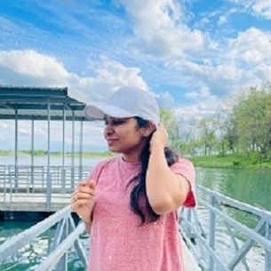
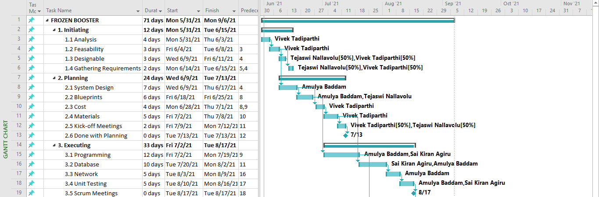
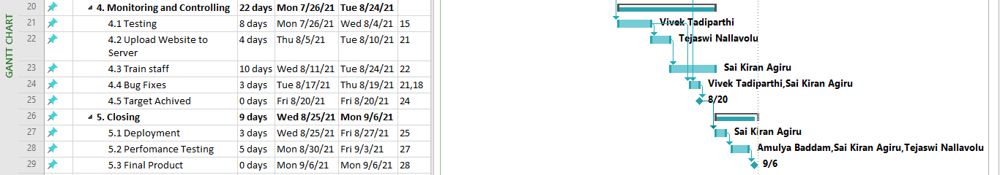

# FROZEN BOOSTER

| Table of Contents |
|-------------------|
| Our Project       |
| Our Team          |
| Project Charter   |
| Scope             |
| Schedule          |
| Budget            |

## Our Project
   ### FROZEN BOOSTER -Yummy in your tummy!
   Explore all our blends in flavorsome real ice cream with rich jimmies and meringue. Our website provides a convinent way to take a look at our menu and order online. We also offer a lot of combos and party packs online. Enjoy your day purposefully with every swig!!
   
 - [Click here to view our Menu](Menu/menu.md)
   

## Our Team - Milkshake Masters!

### Milkshake Masters!

   [Sai Kiran Agiru](https://github.com/saikiranagiru) &nbsp;&nbsp;&nbsp;&nbsp;&nbsp;&nbsp;&nbsp;&nbsp;&nbsp;&nbsp;&nbsp;&nbsp;&nbsp;&nbsp;&nbsp;&nbsp;&nbsp;&nbsp;&nbsp;&nbsp;&nbsp;&nbsp;&nbsp;&nbsp;&nbsp;&nbsp;&nbsp;&nbsp;&nbsp;&nbsp;&nbsp;&nbsp;&nbsp;&nbsp;&nbsp;&nbsp;&nbsp;&nbsp;&nbsp;&nbsp;&nbsp;&nbsp;&nbsp;&nbsp;&nbsp;&nbsp;&nbsp;&nbsp; [Sai Vivek Reddy Tadiparthi](https://github.com/vivektadiparthi)                       

    &nbsp; 
  

   [Tejaswi Reddy Nallavolu](https://github.com/TejaswiNallavolu) &nbsp;&nbsp;&nbsp;&nbsp;&nbsp;&nbsp;&nbsp;&nbsp;&nbsp;&nbsp;&nbsp;&nbsp;&nbsp;&nbsp;&nbsp;&nbsp;&nbsp;&nbsp;&nbsp;&nbsp;&nbsp;&nbsp;&nbsp;&nbsp;&nbsp;&nbsp;&nbsp;&nbsp;&nbsp;&nbsp;&nbsp;&nbsp;&nbsp;&nbsp;&nbsp;&nbsp; [Amulya Baddam](https://github.com/amulyabaddam555)

    &nbsp; 

Amulya Baddam is the fourth contributer of this project. The Github account is unavailable. Please find the commits from the link below.
[Commits](https://github.com/saikiranagiru/pm-s04-g06-project/commits/main)

## Project Charter
- [Click here to view our Project Charter](Charter/charter.md)

## Scope
### Work Breakdown Structure

#### 1. Initiating
- 1.1 Analysis
- 1.2 Feasability
- 1.3 Designable
- 1.4 Gathering Requirements

#### 2. Planning
- 2.1 System Design
- 2.2 Blueprints
- 2.3 Cost
- 2.4 Materials
- 2.5 Kick-off Meetings

#### 3. Executing
- 3.1 Programming
- 3.2 Database
- 3.3 Network
- 3.4 Unit Testing

#### 4. Monitoring and Controlling
- 4.1 Testing
- 4.2 Upload Website to Server
- 4.3 Train staff
- 4.4 Bug Fixes

#### 5. Closing
- 5.1 Deployment
- 5.2 Perfomance Testing

    

- [Click here to view our Wbs file](Scope/wbs.mpp)

## Schedule
- ### Start date: 05/31/2021
- ### End date: 09/06/2021
- ### Duration: 14 weeks
   
  
- [Click here to view our Schedule file](Schedule/scheduling.mpp)

## Budget
The Budget for the project is $55000.  

- [Click here to view our Budget file](Budget/Budget.xlsx)

## Pivot Tables

    

    
  
    

  

